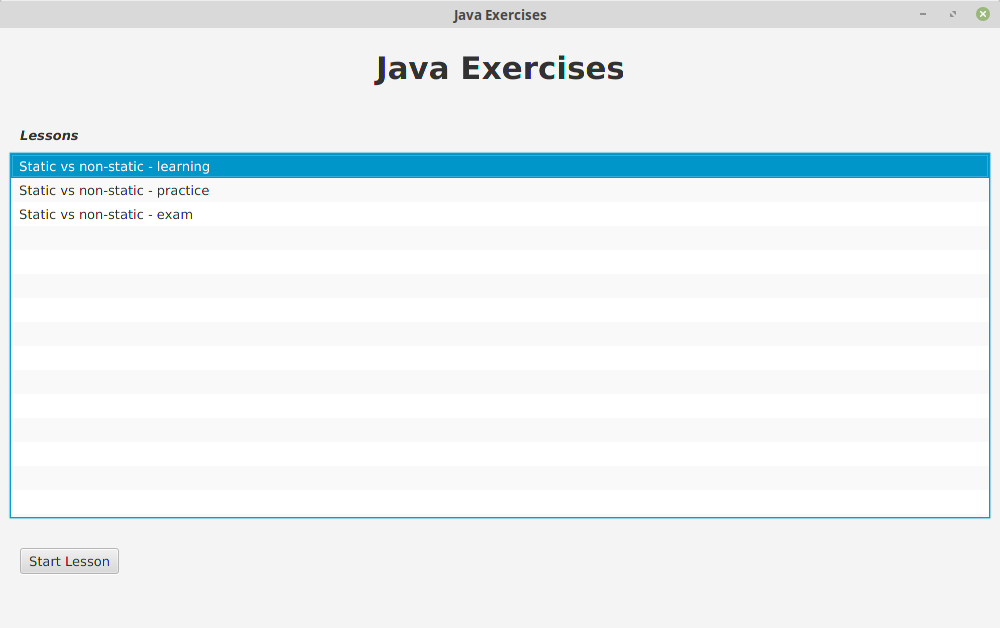
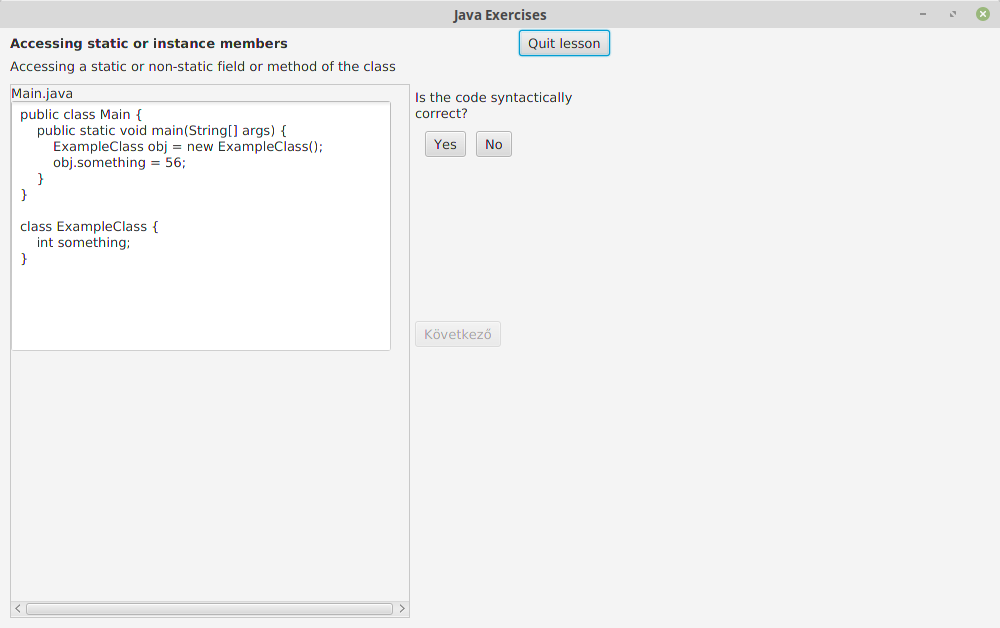

# Java Exercises

Lesson selection

Answering an exercise

## Usage

### Launching the app
* The application has two possible entry points:
  * gui_javafx/MainFX
  * gui_swing/MainSwing

#### Without JavaFX (with Swing)
* Raw solution: delete *gui_javafx* package that uses the external JavaFX library

#### With JavaFX
* JavaFX was part of JDK 8 but was removed from JDK 11
* You have to download and include it in the project: [Download](https://gluonhq.com/products/javafx/)
* See for installation information: [openjfx.io](https://openjfx.io/openjfx-docs/#introduction)	

### Creating new _Lessons_ and _Exercises_
* _later_

### Developing the model
* Parts
  * GUI (Swing and JavaFX)
  * Exercise types (ExerciseFactory implementations)
  * Lessons (~exercise lists) - now in res/lessons/BuiltInForTest.java, later in JSON
  * Model (Exercise elements and Language elements)
* Principles
  * The purpose is not to rewrite Java language :smile:, but modeling it in a more or less general way
  * The model has to be able to generate false syntax too (so modeling only the correct behavior is incorrect)
  * Using only one model would be the best, but I don't want to strictly exclude using more than one
* Licence
  * _later_
* Inspiration
  * [The Java Language Specification](https://docs.oracle.com/javase/specs/jls/se10/jls10.pdf)

## TODO list
* Elegant GUI wanted (for both Swing and JavaFX)
* Lesson/Course editor
* Proper documentation
  * Javadoc
  * UML (Class diagram, ...?) for 'Lesson-Exercise' model
  * UML for 'language elements' model
  * Guide to create an ExerciseFactory
  * Guide to create a Lesson or a Course
* Much more exercises
  * E.g. AccessModifiers, SubClassMethods, ManyConstructors, InitalizationChain
* ...

